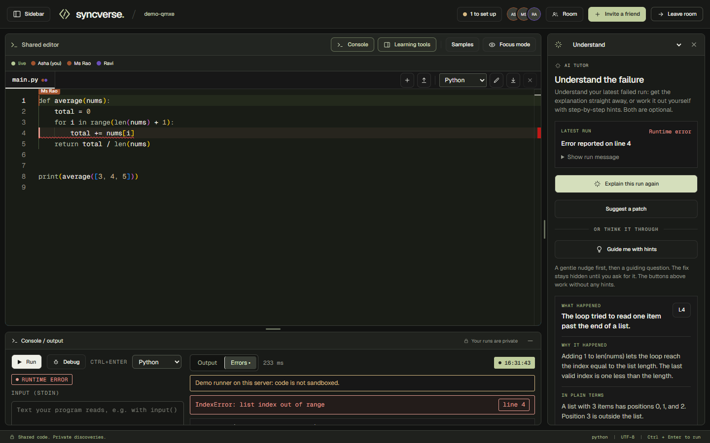
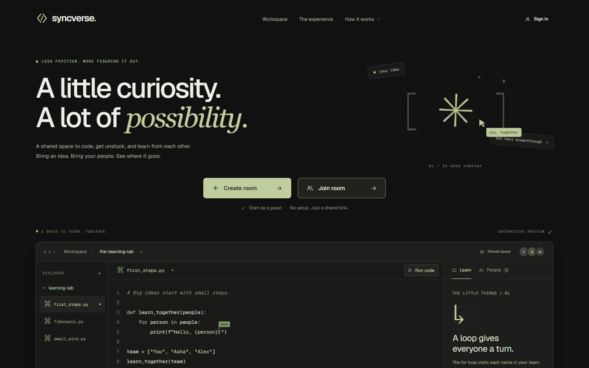
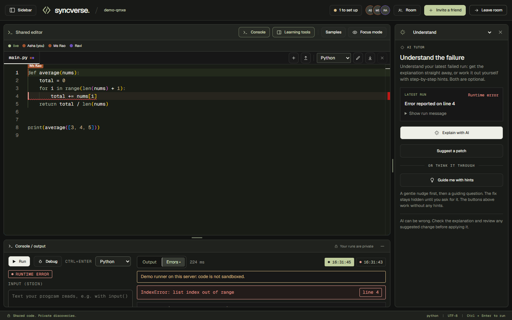
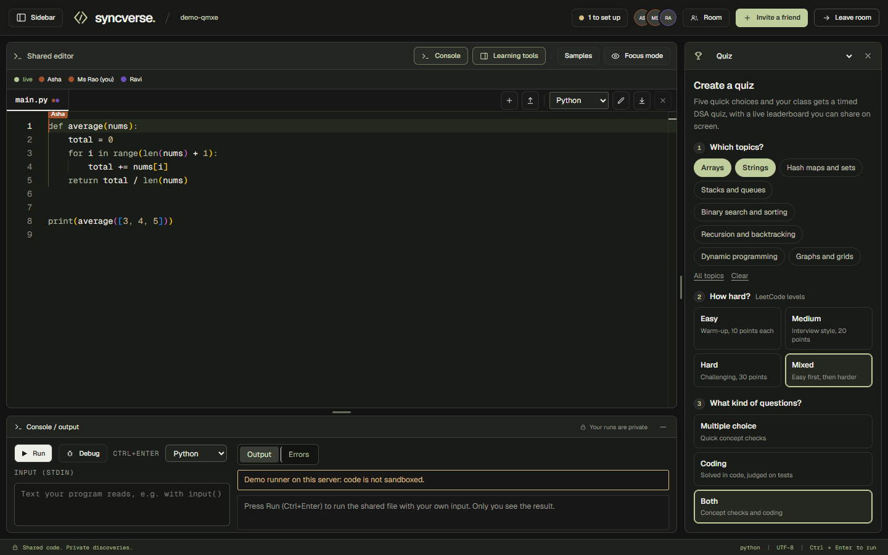
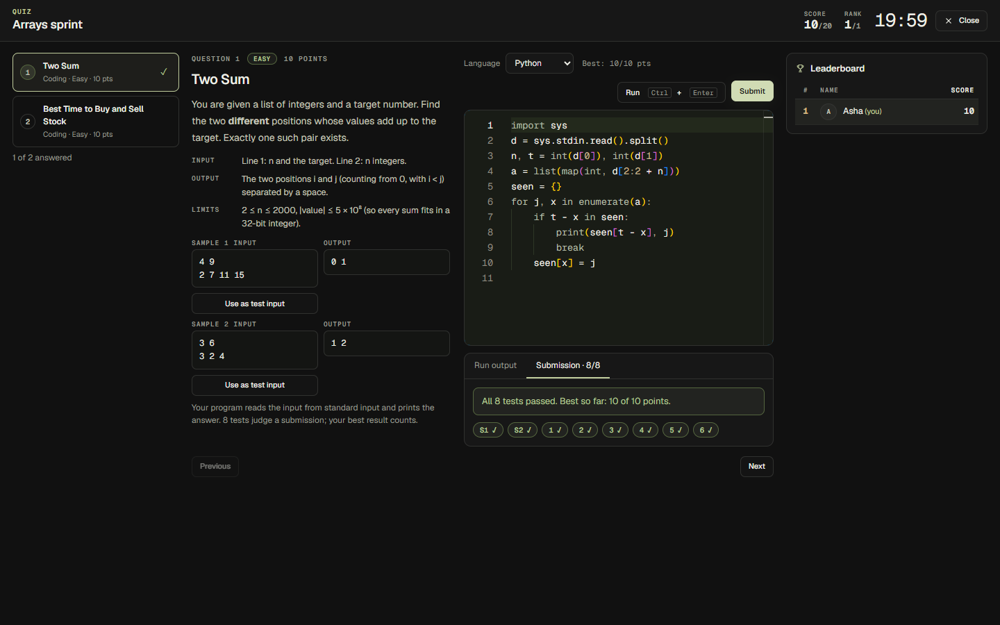
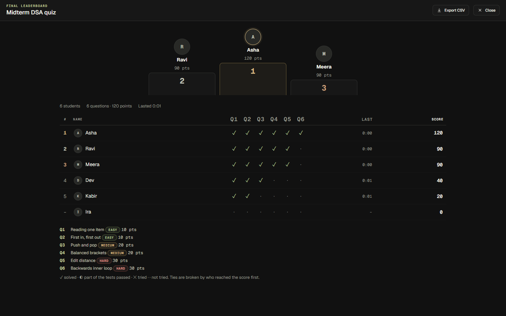
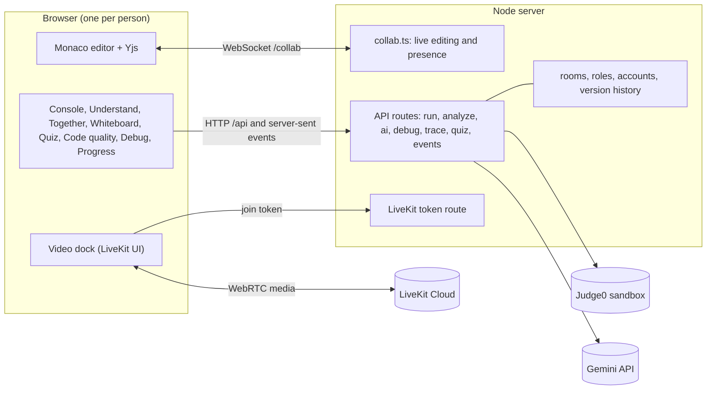
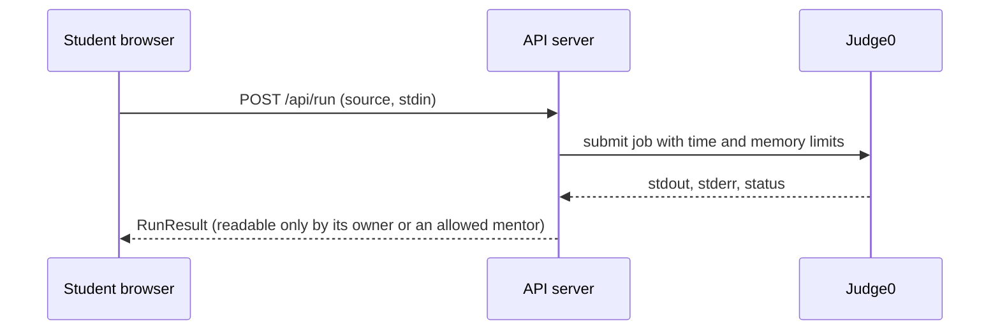

# SyncVerse

**Learn to code together, understand it on your own.**

SyncVerse is a collaborative real-time code editor for remote STEM education (problem statement PS 02). People share one editor, run code
privately, get an AI tutor that teaches instead of just answering, and learn together: mentors help without taking over, and a class can sit
a timed DSA quiz with a live leaderboard.



## What is in it

| | |
|---|---|
| **Write together** | One shared Monaco editor with live cursors and presence, several files per room, version history, VS Code-style snippets, a shared whiteboard, and a video call (LiveKit) in the same window. |
| **Run privately** | Python, Java, JavaScript, C and C++ in a Judge0 sandbox. Everyone shares the code; every run, explanation and debug session belongs to one person. |
| **Understand the failure** | An AI tutor explains a failed run to a beginner, proposes a patch you review before it touches the code, or guides you with an optional **hint ladder** (a nudge, a guiding question, then the fix). Works for DSA practice and for big programs alike. |
| **See it run** | A **step-through debugger** (Python): watch every variable change line by line, `i: 0 → 1 → 2 → 3`, on correct code and on failing code, alone or together with a mentor who follows along live. |
| **Teach and test** | A **quiz arena**: a mentor creates a timed DSA quiz in five short choices, students solve multiple-choice and LeetCode-style coding questions, and everyone watches a live leaderboard that ends in a podium. |
| **Learn from the work** | Progress observations from real runs (never grades), a code quality checker, mentor tiles that show who is stuck (status only), and debug access that a student grants and can revoke at any moment. |



## Features

### Collaboration
- **Real-time editing** with Yjs: labelled cursors, "typing" and "idle" presence, offline edits that merge when the connection returns,
  rooms that persist on the server. Several files per room (new, rename, delete, upload, download), 16 languages recognised by name.
- **Rooms and roles:** owner, mentor, student, viewer (read-only), verified by the server. Owners and mentors can pause a person's editing,
  freeze the room and remove people; the owner can lock mentor seats. Guests need only a name; accounts are optional (sign in, a profile,
  "your rooms").
- **Version history:** manual saves, autosave every five minutes and when the last person leaves, preview and restore.
- **Video call:** camera, microphone, screen share and chat (LiveKit), with a low-bandwidth mode that drops to audio only.
- **Whiteboard:** pen, shapes, text, eraser, undo, colours and sizes, saved with the room, exportable as PNG.
- **Built for everyone:** a dark design, keyboard access, WCAG 2.1 AA checked with axe, phone and tablet layouts.

### Running code and learning from it
- **Console:** run with your own input (Ctrl+Enter), see the failing line marked in the editor, keep your last runs. Output is readable only by
  its owner. A **Debug** button sits next to Run.
- **Demo programs in five languages:** the Samples menu loads each planted-bug demo in the open file's language, and switching a file's
  language converts an untouched demo ([details](docs/features/demo-programs.md)).
- **AI tutor** ([details](docs/features/ai-tutor.md)): explain, patch review with Accept / Reject, built-in answers that need no key, and the
  [hint ladder](docs/features/hint-ladder.md).
- **Step-through debugger** ([details](docs/features/debugger.md)): variables with their history, call stack, output so far, run to a line,
  play, and a live mentor view.
- **Code quality:** formatting, naming, smells, complexity and security findings for Python.
- **Your progress:** observations and what to practise next, from real runs. Never scores or rankings.

### Teaching
- **Quiz arena** ([details](docs/features/quiz.md)): 88 questions over eight DSA topics and three LeetCode levels, judged automatically, a live
  leaderboard, a final podium, answers and model solutions, CSV export.
- **Collaborative debugging:** a mentor asks, the student allows (view only, or "assist" so the mentor can re-run the code and suggest an edit the
  student accepts or rejects). Both sides get notices; the student can revoke at any time; access ends when the student leaves.
- **Mentor overview:** tiles with run counts and a "stuck" flag (status only, no code), "ask for help" flags, class trends, and one-line
  broadcasts to the room.

## See it

| | |
|---|---|
|  |  |
| The hint ladder: nudge, guiding question, then the fix, all optional | The step-through debugger following a loop |
|  |  |
| A mentor sets up a quiz in five choices | A student solving a coding problem, judged on hidden tests |
|  | |
| The final leaderboard with a podium | |

## How it works



**Shared code, private execution.** The editor text is shared through Yjs, while every run, explanation, trace and quiz answer belongs to one
person; the server checks that in the API, not just in the UI.



The debugger and the quiz judge reuse the same runner: the debugger runs the program inside a small Python tracer, the judge runs a
submission once per test and compares the output.

## Quick start

Needs Node 20 or newer (tested on Node 24). The app also runs on a laptop with no keys at all: the built-in answers and a labelled local
runner (Python and JavaScript, not sandboxed) take over.

```
npm install
copy .env.example .env     # macOS / Linux: cp .env.example .env, then fill in the keys you have
npm run dev
```

- **App:** http://localhost:5173 (proxies `/api` and `/collab` to the server)
- **Server:** http://localhost:4000, health at http://localhost:4000/api/health (shows which keys are configured)
- **Two people on one machine:** use two browser tabs; each tab is a different person. Skip the form with
  `http://localhost:5173/?name=Asha&role=mentor&room=loops-101`.
- **Other devices** on the same network or a phone hotspot: open `http://<your-laptop-ip>:5173`.

### Configuration (`.env`, never committed)

| Setting | What it turns on | Without it |
|---|---|---|
| `JUDGE0_URL` (+ `JUDGE0_API_KEY`, `JUDGE0_API_HOST` for a hosted key) | Running code in five languages in a sandbox; the free public instance `https://ce.judge0.com` needs no key | Set `RUNNER=local` for the demo runner: Python and JavaScript, not sandboxed |
| `LLM_API_KEY` (+ `LLM_MODEL_FAST`, `LLM_MODEL_STRONG`) | AI explanations, patches and hints from Gemini | Built-in answers for the demo bugs and rule-based hints still work |
| `LIVEKIT_URL`, `LIVEKIT_API_KEY`, `LIVEKIT_API_SECRET` | The video call | Video is off, everything else works |
| `AUTH_SECRET`, `REQUIRE_AUTH=1`, `ADMIN_TOKEN` | Signed tokens, accounts-only mode, the admin log endpoint | Guests allowed, defaults used |
| `PORT`, `LOG_LEVEL`, `LOG_RETENTION_DAYS`, `LOG_TO_FILE` | Server port and logging | Port 4000, info logs |

Bad values stop the server with a clear message, and the status chip in the top bar shows what is set up. Rooms, accounts and quizzes are
saved under `server/data/` (git-ignored).

## Try it in three minutes

1. Open the app, create a room as a **mentor**, and open the invite link in a second tab as a **student**.
2. Edit the same file in both tabs. Press **Run**: only the person who ran sees the output.
3. The room starts on a program with a loop that goes one step too far. Run it, open **Understand**, and try **Explain with AI**, or
   **Guide me with hints** for the ladder. Press **Debug** to watch `i` go 0, 1, 2, 3 and the program stop on the error.
4. In **Debug**, let the mentor request access; allow it and watch the mentor follow the student's debugger live.
5. As the mentor, open **Quiz**, answer the five choices and press Start; solve a question as the student and watch the leaderboard move.

The full five-minute demo script and the demo-morning checklist are in [docs/DEMO.md](docs/DEMO.md).

## Testing

Every check starts from the command line. Most browser checks need Microsoft Edge (Playwright drives it); many start their own servers, the
others need `npm run dev` running.

| Command | What it checks |
|---|---|
| `npm run typecheck`, `npm run build` | server and web compile; production build |
| `npm run smoke` | server health, Yjs sync, merge, presence and persistence (needs the server) |
| `npm run e2e`, `e2e:entry`, `e2e:studio`, `e2e:a11y` | live editing in two browsers; the entry page, tools and keyboard access; the whole frontend; an axe accessibility audit of every screen |
| `npm run e2e:golden` | the whole demo with three browsers (`-- --strict` on demo morning) |
| `npm run e2e:rooms`, `test:rooms`, `test:persist`, `e2e:reconnect` | rooms, roles and accounts; persistence across a hard restart; offline edits merging after a reconnect |
| `npm run e2e:whiteboard`, `e2e:snippets`, `e2e:language`, `e2e:video`, `e2e:call-layout` | the whiteboard, snippets, switching languages, the video dock |
| `npm run verify:samples`, `verify:demos` | every planted-bug program (Python, then all 46 across five languages) behaves as named, in the real runner |
| `npm run e2e:hints`, `node web/src/ai/check-api.cjs`, `check-hints.cjs`, `check-browser.mjs` | the AI tutor and the hint ladder |
| `npm run test:trace`, `e2e:debugger` | the step-through debugger: traces, privacy, live events, notices, both roles |
| `npm run test:quiz`, `test:quiz:languages`, `verify:quiz`, `e2e:quiz`, `gen:quiz` | the quiz: API, judging in four languages, the question bank, browsers, regenerating test outputs |
| `npm run preflight` | demo warm-up: env, ports, live sync, Judge0, LiveKit, AI (`-- --strict` on demo morning) |

The lane suites (`scripts/test-lane-d*.mjs`, `scripts/e2e-lane-d*.mjs`, `scripts/laneb-*.mjs`) cover the run pipeline, the code quality
analyzer and debug access. `npm run docs:screenshots` regenerates the images in `docs/images/` from the running app.

## Project structure

```
shared/            contracts every part imports (@syncverse/shared): types, files and languages, samples, quiz, debugger, whiteboard
server/            Express API and the Yjs WebSocket server
  routes/            run, analyze, ai, debug, trace, quiz, events, rooms, livekit
  quiz/              the question bank, the judge and the quiz store
  debugger/          the Python tracer
  collab.ts          live editing and presence; roomstore.ts, auth.ts, versions.ts, logger.ts, env.ts
web/               the frontend: Vite, React, Tailwind
  src/studio/        the workspace shell, entry page preview and layout
  src/editor, console, ai, debug, quality, progress, quiz, whiteboard, video, demo/   one folder per tool
docs/              demo script, test-id contract, tracker, feature pages, lane notes, plans, sample programs, images
scripts/           smoke, browser and API checks, the demo warm-up, screenshots
```

Built with TypeScript, React 19, Vite, Tailwind, Monaco, Yjs, Express, LiveKit, Judge0 and Gemini.

## Documentation

- Features: [quiz](docs/features/quiz.md), [hint ladder](docs/features/hint-ladder.md), [step-through debugger](docs/features/debugger.md),
  [AI tutor](docs/features/ai-tutor.md), [demo programs](docs/features/demo-programs.md); the frontend: [web/README.md](web/README.md)
- Running a demo: [docs/DEMO.md](docs/DEMO.md); the UI test-id contract: [docs/TESTIDS.md](docs/TESTIDS.md)
- Working on it: [CONTRIBUTING.md](CONTRIBUTING.md), the team tracker [docs/TRACKER.md](docs/TRACKER.md), per-area notes in [docs/lanes/](docs/lanes/)
- Background: the plan and the long-term design in [docs/plans/](docs/plans/), earlier working notes in [docs/archive/](docs/archive/)

## Team and branches

Built for a hackathon by four people, one area each: **Akshit** (editor sync, presence, video, frontend design, rooms, quiz, debugger),
**Simrit** (run pipeline, console, code quality), **Rahil** (AI tutor) and **Miti** (debug access, progress, demo data).

`main` is the default and the integration branch and always holds the most complete, working version. Work on your own branch, merge
`origin/main` into it often, and merge back when `npm run typecheck`, `npm run smoke` and `npm run e2e:golden` pass.

```
git clone https://github.com/akshitsharma24-ux/SyncVerse.git
cd SyncVerse
git config core.autocrlf input
npm install
npm run dev
```

Commit messages say what changed and why, with the task ID where there is one (`P-B1: poll Judge0 until done`). Never commit `.env`.
