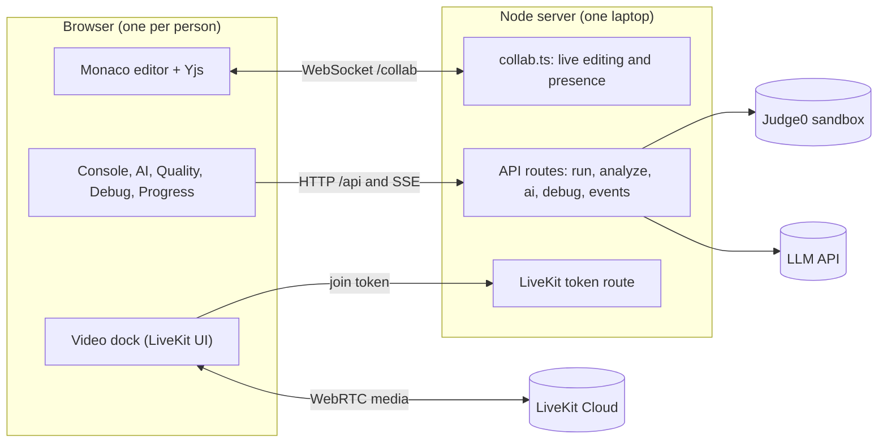
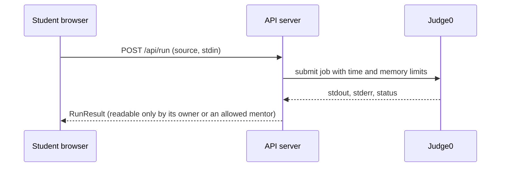

# SyncVerse

Collaborative real-time code editor for remote STEM education (PS 02). Overnight prototype.

- Plan for tonight: `SyncVerse_Overnight_Prototype_Plan.pdf`
- Long-term design: `SyncVerse_Master_Blueprint.pdf`
- Live status and handoff: `docs/TRACKER.md`
- Demo script and demo-morning checklist: `docs/DEMO.md`; UI test contract for lane panels: `docs/TESTIDS.md`
- Conventions for people and Claude sessions: `CLAUDE.md`

## Architecture



Shared code, private execution: the editor text is shared through Yjs, while every run, explanation and debug view belongs to one person.


## Quick start

Needs Node 20 or newer (tested on Node 24).

```
npm install
copy .env.example .env     # fill in keys as your lane needs them
npm run dev
```

- Web: http://localhost:5173  (proxies /api and /collab to the server)
- Server: http://localhost:4000, health at http://localhost:4000/api/health (shows which keys are configured)
- Two users on one machine: use two browser **tabs**. Skip the form with `/?name=Asha&role=mentor&room=loops-101`.
- Other devices on the same network or phone hotspot: open `http://<your-laptop-ip>:5173`.

Useful commands (run the checks while `npm run dev` is running, after every merge to main):

| Command | What it checks |
|---|---|
| `npm run typecheck` | server and web compile |
| `npm run build` | production build |
| `npm run smoke` | server health, Yjs sync/merge/presence/persistence (8 checks) |
| `npm run e2e` | two real Edge sessions: live editing, cursors, presence, markers (13 checks) |
| `npm run e2e:entry` | entry page: create/join flow, invite link, validation, phone/tablet layout, animated editor, workspace tabs and resizing (11 checks) |
| `npm run e2e:video` | video dock UI (real media needs LiveKit keys and two devices) |
| `npm run e2e:golden` | the whole demo with three browsers; steps SKIP until a lane's panel exists (`-- --strict` on demo morning) |
| `npm run e2e:a11y` | axe-core accessibility audit (WCAG A/AA) of the entry page and every workspace tab |
| `npm run verify:samples` | runs every planted-bug program with real Python and checks the shared fixtures |
| `npm run preflight` | demo warm-up: env, ports, live sync, Judge0, LiveKit, LLM (`-- --strict` on demo morning) |
| `npm run test:persist` | code survives a hard server restart (starts its own server on :4101) |
| `npm run e2e:reconnect` | server dies mid-session: offline edits merge after reconnect (starts its own servers on :4300/:5300) |

If an e2e run stalls while launching the browser, just run it again.

## Repository and branches

Repo: https://github.com/akshitsharma24-ux/SyncVerse

**`main` is the default branch and the integration branch.** It always holds the most complete, working version. Each person also has a lane branch:

| Branch | Owner | Lane |
|---|---|---|
| `main` | everyone | integrated, demo-ready work (skeleton + Lane A + shared tooling + Lane D so far) |
| `lane-a-akshit` | Akshit | editor sync, presence, video, frontend design |
| `lane-b-simrit` | Simrit | run pipeline, console, code quality |
| `lane-c-rahil` | Rahil | AI explain and patch |
| `lane-d-miti` | Miti | debug access, progress, demo data |

```
git clone https://github.com/akshitsharma24-ux/SyncVerse.git
cd SyncVerse
git config core.autocrlf input
git checkout lane-b-simrit        # your own branch
git merge origin/main             # start from the latest main
npm install
copy .env.example .env            # then fill in your keys
npm run dev
```

- Work on your own lane branch and commit with the task ID: `P-B1: poll Judge0 until done`.
- Merge `origin/main` into your branch often. When a task is done and `npm run typecheck`, `npm run smoke` and `npm run e2e:golden` pass, merge your branch into `main`.
- No `Co-Authored-By` or "generated with" lines in commits (see CLAUDE.md).
## Layout

```
shared/types.ts        contracts every lane imports (@syncverse/shared)
web/src/               Vite + React shell; one folder per lane (editor, video, console, quality, ai, debug, progress, demo)
server/                Express; routes/*.ts one file per lane; collab.ts is the Yjs WebSocket
docs/TRACKER.md        status + handoff;  docs/lanes/  one file per lane
scripts/smoke.mjs      automated checks
```


