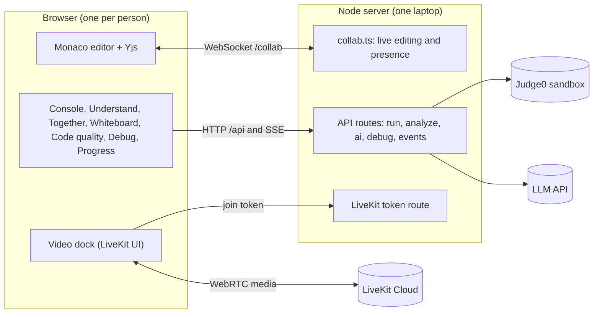
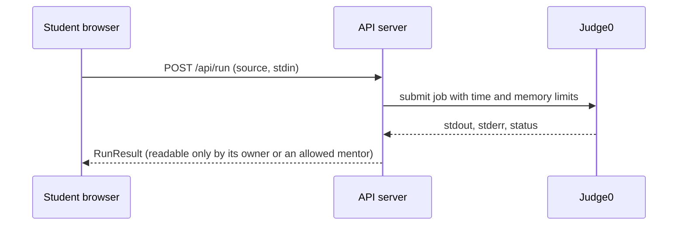

# SyncVerse

Collaborative real-time code editor for remote STEM education (PS 02). Overnight prototype.

- Plan for tonight: `SyncVerse_Overnight_Prototype_Plan.pdf`
- Long-term design: `SyncVerse_Master_Blueprint.pdf`
- Live status and handoff: `docs/TRACKER.md`
- Demo script and demo-morning checklist: `docs/DEMO.md`; UI test contract for lane panels: `docs/TESTIDS.md`
- Conventions for everyone who contributes: `CONTRIBUTING.md`
- Lane C five-part plan and account handoff: `PlanLaneC.md`

## What it does (problem statement PS 02)

| Requirement | Where to see it |
|---|---|
| Real-time multi-user editing | The shared editor: Monaco + Yjs, labelled cursors, presence, several files per room, version history, Tab snippets (Java `sout`, `fori`, ...) |
| Integrated video chat | **Together** tool (LiveKit): camera, mic, screen share, chat |
| AI assistant that explains errors to beginners | **Understand** tool: explain a failed run, then review a patch and Accept or Reject it |
| Live code execution in a sandbox | The console. Real sandbox through Judge0 when `JUDGE0_URL` is set in `.env`; without it a clearly labelled demo runner (Python and JavaScript, not sandboxed) |
| Automated code quality analysis | **Code quality** tool: formatting, naming, smells, complexity, security (Python rules) |
| Collaborative debugging | **Debug** tool: a mentor asks, the student allows; read-only mirror, point at a line, and with "assist" re-run the code and suggest an edit the student accepts or rejects |
| Personalized learning progress | **Your progress** tool: observations and next concepts from real runs, no scores or rankings |
| Extra: whiteboard | **Whiteboard** tool: everyone draws on one page, live |

## Frontends

`web/` is the only frontend: the dark **Quiet Studio** design (entry page, resizable workspace, learning tools in a side panel).
See `web/README.md`.

## Architecture



Shared code, private execution: the editor text is shared through Yjs, while every run, explanation and debug view belongs to one person.


## Quick start

Needs Node 20 or newer (tested on Node 24).

```
npm install
copy .env.example .env     # fill in keys as your lane needs them
npm run dev
```

- Web: http://localhost:5173  (proxies /api and /collab to the server)
- Server: http://localhost:4000, health at http://localhost:4000/api/health (shows which keys are configured)
- Two users on one machine: use two browser **tabs**. Skip the form with `/?name=Asha&role=mentor&room=loops-101`.
- Other devices on the same network or phone hotspot: open `http://<your-laptop-ip>:5173`.

### Lane C Gemini gateway (Part 1)

**Latest key update:** A replacement Gemini key has been saved to ignored local `.env`, and the dev server restarted. The user will test this key; no generation calls or test suites were run for the replacement. The provider failures documented below describe the earlier key.

After copying `.env.example` to `.env`, put your Google Gemini API key in `LLM_API_KEY`. Preserve an existing `.env` when resuming work. The server reads this key; never put it in `web/` code or commit `.env`. `LLM_MODEL_FAST` defaults to `gemini-3.8-flash`; Part 3 uses `LLM_MODEL_STRONG` (default `gemini-3.1-pro-preview`) for patches.

`POST /api/ai/explain` accepts `{ "runId": "..." }` with the same SyncVerse identity headers used by the web app. The run must exist and have a learner code error. Access is checked through Lane D's `canView` contract; while that lane is still a stub, only the run owner is allowed. The route uses the parser's error line, sends a small window of the relevant source to Gemini, validates the structured response, and returns an `Explanation`. Exact planted IndexError, NameError, and missing-colon SyntaxError examples have pre-seeded responses, so those samples still work before an API key is configured. Uncached Gemini requests are limited to 10 per user in each 10-minute window; successful responses are cached in memory for 30 minutes, and cache hits do not use that request allowance. These safeguards reset when the server restarts.

Rechecked on 2026-09-30 after the account handoff: Google's model-list endpoint returned HTTP 200 with this key, but the real explanation request returned provider HTTP 503. The real patch request returned a provider quota error (mapped to `503 ai_quota_exceeded` by this app). Live Gemini generation remains blocked; successful authentication and the health configuration flag do not prove generation works. The configured key stays in ignored local `.env`.

### Lane C explanation panel (Part 2)

Open the **Understand** tool in the workspace. When Lane B sets `useWorkspace().lastRun` to a failed run, the panel offers **Explain with AI**, highlights the parser-reported line, and displays the explanation sections and concepts. It also shows loading, retry, no-run, and service-configuration states. The `AI can be wrong` note stays visible with every result. Until Lane B's run route stores results, the panel offers **Load sample into shared editor**: this replaces the shared editor contents with a fixed TypeError example but does not execute it. The matching synthetic run lets the panel call the Part 1 endpoint before Lane B lands. The AI request currently reaches Gemini, which is returning HTTP 503; normal failed runs still depend on Lane B records.

### Lane C patch review (Part 3)

Part 3's local sample workflow is implemented and verified on `lane-c-rahil`, ready for user review. Live Gemini generation and integration with Lane B's real runs remain pending. Parts 4 and 5 have not started.

**Demo:** Open http://localhost:5173/?name=Rahil&role=student&room=lane-c-review while `npm run dev` is running. This is a local demo on this computer, not a hosted deployment.

1. In the **AI** tab, choose **Load sample into shared editor**. It replaces the room's code with a labelled, non-executed TypeError example.
2. **Explain with AI** exercises the Part 1 gateway and Part 2 panel/highlight. With the current provider failure, expect a clear error instead of a generated explanation.
3. Choose **Suggest a patch** to see the Part 3 Monaco diff. For the exact built-in example, the proposal is explicitly labelled **SAMPLE PATCH · NOT AI GENERATED** and works without a Gemini call.
4. **Reject patch** keeps the document unchanged. Open another browser session in the same room, request the patch again, then **Accept patch**: the corrected source appears in both editors.
5. Edit the code in the second session while a preview is open. Accept becomes disabled; **Regenerate for current code** submits the latest source. Changed sample code uses the live Gemini path and will currently show its provider/quota error without applying a patch.

`POST /api/ai/patch` retains the `{runId}` contract, with optional `source` for regeneration against the current editor. It returns `patchedSource` plus review metadata (`baseSource`, `summary`, `sourceChangedSinceRun`, and `source`). Requests require owner/grantee access and a completed learner error. Empty, oversized, unchanged, fenced, or plainly unrelated output is rejected. Validation is a structural/relevance check, not proof of program correctness. Accept checks the current editor against `baseSource` immediately before `replaceAll`; Reject never calls `replaceAll`. `/api/ai/patch/decision` logs accepted/rejected decisions through Lane D's existing contract. The synthetic example uses the reserved `ai-demo` run room; real runs retain their own room.

Validation commands are kept in the Lane C folder to avoid edits to other lanes or shared package scripts:

```sh
node web/src/ai/check-api.cjs
node web/src/ai/check-browser.mjs
```

The API check uses fixture runs and mocked Gemini responses, requires no key, and covers the request contract, privacy, input/output validation, retries, quota errors, and decision events. The browser check needs the dev servers and installed Edge; it covers the real sample Accept/Reject flow in two browser contexts, stale previews, and labelled automated mocks for regeneration, in-flight edits, and provider failure. These tests do not establish live Gemini success. The handoff audit also fixed Monaco model cleanup when closing the diff.

Final Part 3 checks on 2026-09-30: 12 API checks PASS, 7 browser checks PASS with no browser runtime errors, server/web typecheck PASS, production build PASS. The existing large-bundle warning remains. Code and documentation are uncommitted on `lane-c-rahil`; user review is the next step.

### Quiz arena (Akshit, 2026-10-01)

A mentor makes a timed DSA quiz for the room in five short choices: **topics** (arrays, strings, hash maps, stacks and queues, binary search and sorting, recursion, dynamic programming, graphs), **difficulty** (LeetCode's Easy, Medium, Hard, or a Mixed ramp), **type of question** (multiple choice, coding, or both), **how many questions** (2 to 10) and **how much time**. Open the **Quiz** learning tool, press Create quiz, then Start quiz.

- **Students** wait in a lobby (they see only how many questions), then answer in a full-window view: multiple-choice questions (one try, instant feedback, the right answer is shown when the quiz ends) and LeetCode-style coding problems with a private Monaco editor in Python, Java, JavaScript, C++ or C. **Run** tries the program on any input; **Submit** judges it on every test (samples plus hidden tests) in the same sandbox as the Run button, and the best submission counts. Points are 10 / 20 / 30 for Easy / Medium / Hard, and a coding answer pays by the share of tests passed.
- **The live leaderboard** updates by itself for everyone (server-sent events). The mentor can switch it off for students while the quiz runs and always sees it, per question (solved, partly right, tried, not tried), with how each question went for the class. Ties go to whoever reached the score first. A **Quiz live** chip sits in the top bar while a quiz runs, and the leaderboard can be opened as a full-window board to share on screen.
- **At the end** (time up, or the mentor ends it) answers close and everyone gets the **final leaderboard with a podium**, the right answers with explanations, and a model solution for every coding problem; the mentor can export a CSV. Earlier quizzes stay in the room's history.
- **The bank** has 88 questions: 48 multiple choice and 40 coding problems, six to eleven per topic across all three levels (`server/quiz/`). Answers and hidden tests never leave the server. The expected output of every hidden test is generated by running that problem's model solution (`npm run gen:quiz`), and each problem's hand-written samples cross-check the solution.
- Quizzes are saved to `server/data/quizzes.json`, so a server restart does not lose a running quiz. Code: `shared/quiz.ts`, `server/quiz/`, `server/routes/quiz.ts`, `web/src/quiz/`.

### Demo programs in every language

The Samples menu and the language switch now cover Python, Java, JavaScript, C and C++. Each planted-bug demo ("Index error", "Name error", "Syntax error", "Infinite loop", "Recursion error", "List aliasing", "Zero division", "Type error", "Stdin average") exists in all five languages in `docs/samples/` (Python at the top, the others in `java/`, `javascript/`, `c/`, `cpp/`). Samples loads the demo in the open file's language (Python when the demo has none, for example the Python-only quality sample), and changing a file's language while it still holds a demo, the room's first program or a hello-world swaps it for the same demo in the new language. Code a person wrote is never replaced. `npm run verify:demos` runs all 46 programs through the real runner and checks each fails (or works) the way its name says.

Useful commands (run the checks while `npm run dev` is running, after every merge to main):

| Command | What it checks |
|---|---|
| `npm run typecheck` | server and web compile |
| `npm run build` | production build |
| `npm run smoke` | server health, Yjs sync/merge/presence/persistence (8 checks) |
| `npm run e2e` | two real Edge sessions: live editing, cursors, presence, markers (13 checks) |
| `npm run e2e:entry` | entry page: create/join flow, invite link, validation, phone/tablet layout, reduced motion, learning tools, keyboard access, dark theme, crash containment (14 checks) |
| `npm run e2e:video` | video dock UI (real media needs LiveKit keys and two devices) |
| `npm run e2e:golden` | the whole demo with three browsers; steps SKIP until a lane's panel exists (`-- --strict` on demo morning) |
| `npm run e2e:a11y` | axe-core accessibility audit (WCAG A/AA) of the landing page, dialogs, every learning tool, the large whiteboard view, the drawer (20 audits) |
| `npm run e2e:studio` | the Quiet Studio frontend end to end: landing page, real rooms, every tool, focus mode, resizing, layout memory, phones, axe |
| `npm run e2e:call-layout` | the video dock's controls and chat at 260 to 650 px (a labelled fixture, no real call) |
| `npm run verify:samples` | runs every planted-bug program with real Python and checks the shared fixtures |
| `npm run preflight` | demo warm-up: env, ports, live sync, Judge0, LiveKit, LLM (`-- --strict` on demo morning) |
| `npm run test:persist` | code survives a hard server restart (starts its own server on :4101) |
| `npm run e2e:reconnect` | server dies mid-session: offline edits merge after reconnect (starts its own servers on :4300/:5300) |
| `npm run e2e:whiteboard` | the shared whiteboard (Whiteboard tool): live drawing, tools, undo, eraser, clear, viewer and paused rules, junk data, large view, PNG, reload (17 checks) |
| `npm run e2e:language` | choosing a language (console or file bar) swaps an untouched file or a loaded demo to the same program in the new language (a Java, JavaScript, C and C++ version of every demo), never replaces your code, viewers cannot switch (10 checks) |
| `npm run verify:demos` | runs every Samples-menu program in all five languages through the real runner (46 programs) |
| `npm run gen:quiz` | regenerates the hidden-test outputs of the quiz bank from the model solutions (checks the hand-written samples) |
| `npm run test:quiz` | quiz API: create, start, answer, judge, live leaderboard, end, permissions, persistence (starts its own server on :4420) |
| `npm run test:quiz:languages` | the quiz judge in Java, JavaScript, C and C++ through the real runner (needs internet, starts its own server on :4421) |
| `npm run verify:quiz` | the question bank: counts per topic and level, well-formed questions, right answers spread over A to D, 5+ tests per problem, expected outputs up to date |
| `npm run e2e:quiz` | the quiz in real browsers: mentor, three students and a viewer, coding and multiple choice, live board, final podium, CSV, phone layout, axe (starts its own servers on :4430/:5430) |
| `npm run e2e:snippets` | VS Code-style completion: Java `sout` + Tab, `fori`, members after a dot, java.util imports, Python / JS / C / C++ snippets, Enter never accepts (17 checks) |

If an e2e run stalls while launching the browser, just run it again.

## Repository and branches

Repo: https://github.com/akshitsharma24-ux/SyncVerse

**`main` is the default branch and the integration branch.** It always holds the most complete, working version. Each person also has a lane branch:

| Branch | Owner | Lane |
|---|---|---|
| `main` | everyone | integrated, demo-ready work: all four lanes, the Quiet Studio frontend, whiteboard and snippets |
| `lane-a-akshit` | Akshit | editor sync, presence, video, frontend design |
| `lane-b-simrit` | Simrit | run pipeline, console, code quality |
| `lane-c-rahil` | Rahil | AI explain and patch |
| `lane-d-miti` | Miti | debug access, progress, demo data |

```
git clone https://github.com/akshitsharma24-ux/SyncVerse.git
cd SyncVerse
git config core.autocrlf input
git checkout lane-b-simrit        # your own branch
git merge origin/main             # start from the latest main
npm install
copy .env.example .env            # then fill in your keys
npm run dev
```

- Work on your own lane branch and commit with the task ID: `P-B1: poll Judge0 until done`.
- Merge `origin/main` into your branch often. When a task is done and `npm run typecheck`, `npm run smoke` and `npm run e2e:golden` pass, merge your branch into `main`.

## Layout

```
shared/types.ts        contracts every lane imports (@syncverse/shared)
web/src/               the default frontend (Quiet Studio): Vite + React; one folder per lane (editor, video, console, quality, ai, debug, progress, demo) plus studio/ (shell) and whiteboard/
server/                Express; routes/*.ts one file per lane; collab.ts is the Yjs WebSocket
docs/TRACKER.md        status + handoff;  docs/lanes/  one file per lane
scripts/smoke.mjs      automated checks
```


