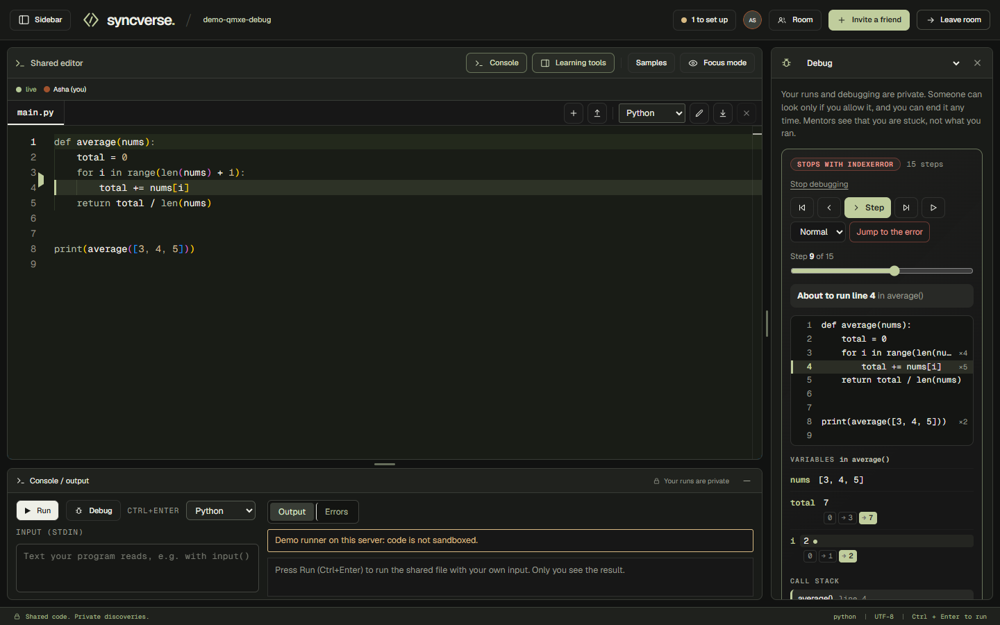

# Step-through debugger

Run a Python program one line at a time and watch every variable change, like the debugger in an IDE: a loop variable goes 0, 1, 2, 3 and
you see it happen. It works on code that runs fine and on code that fails (it stops on the error and says which line). It works alone, and
between a student and a mentor.

## Using it

- Press **Debug** next to Run in the console, or **Debug my code** in the **Debug** tool. The open file is traced and the stepper opens.
- **Step** / **Step back** (or the arrow keys), **First** / **Last**, **Play** (slow, normal, fast) and a slider move through the steps.
- The current line is marked in the shared editor (olive band and a gutter arrow) and in the stepper's own code box. Click a line number to
  **run to that line**: each click jumps to the next time that line runs, which is the quickest way to watch a loop pass by.
- **Variables** shows the current frame. A variable that changed in this step is marked, and every variable shows its history, for
  example `i: 0 → 1 → 2 → 3` with the current value highlighted. The **call stack** shows recursion with a separate frame per call, and
  **Output so far** shows what the program has printed up to this step.
- **Jump to the error** goes to the step that raises. A program that cannot start (a syntax error) shows the error and no steps.
- Other languages: the Debug button explains that stepping works for Python files; Run works in every language.

## With a mentor

Debugging is private. A mentor asks in the **Debug** tool, the student allows (see "Collaborative debugging" in the README), and then the
mentor sees the student's latest trace:

- the mentor **follows the student live**: when the student steps, the mentor's view moves with them (the line is marked in the mentor's
  editor too, since the room shares one file);
- the mentor can **step on their own** (a banner says where the student is) and press **Follow** to rejoin;
- a new trace from the student is announced to the mentor, and revoking access cuts the mentor off at once.

Notices (toasts, whichever tool is open): the student hears "X asked to see your session" (with the allow / deny dialog) and "X is no
longer viewing your session"; the mentor hears "X allowed you to view their session", "X declined your request", "Your access to X's
session ended" and "X is stepping through their code".

## How it works

The server wraps the program in a small Python harness (`server/debugger/pytrace.ts`) and runs it once through the normal code runner (the
Judge0 sandbox, or the local fallback). The harness uses `sys.settrace` to record a step before every line, return and raised exception,
captures what the program prints, and writes one JSON document between two markers. To stay small, each step carries only the variables
that **changed** since the last step of that frame, and values are shortened with `reprlib`, so a list of a million items costs the same as
a list of ten. `shared/debugger.ts` replays the steps into full snapshots in the browser.

Limits: at most 1500 steps, about 240 KB of trace and about 4 seconds of tracing. When a limit is reached the trace so far is returned with a
"limit reached" note and the program is stopped, so an infinite loop still shows its first iterations instead of timing out with nothing.

## API

| Route | What |
|---|---|
| `POST /api/debug/trace` | `{ roomCode, source, stdin?, language? }` returns the trace (also stored as the caller's latest) |
| `GET /api/debug/trace/latest?ownerId=` | the trace and the owner's current step; the owner, or a mentor with an active grant (same rule as runs) |
| `POST /api/debug/trace/position` | `{ id, step }`, owner only; pushed to the mentors watching |

Events to watching mentors on `/api/debug/events`: `trace` (a new trace) and `trace-step` (the position). Each trace is logged as a `trace`
learning event; the Progress page adds one neutral line ("You stepped through your code N times").

Code: `shared/debugger.ts`, `server/debugger/`, `server/routes/trace.ts`, `web/src/debug/Stepper.tsx`, `web/src/debug/stepper-context.tsx`,
`web/src/debug/StepperSections.tsx`.

## Tests

`npm run test:trace` (API: failing and correct programs, recursion, input, infinite loops, syntax errors, privacy, live events; set
`TRACE_RUNNER=judge0` to run the same checks in the real sandbox) and `npm run e2e:debugger` (browsers: alone, then student and mentor with
every notice, follow, step alone, new trace, revoke, deny, phone layout, accessibility).
